# Scratch

## Provcont Trust And Issuance Workflow

```mermaid
flowchart TD
    A[1. Create provcont] --> B[2. Init trust root]
    B --> C{3. CA key}
    C -->|Prod| D[4a. PKCS#11/PIV CA]
    C -->|Lab| E[4b. File CA]
    D --> F[5. Publish CA cert]
    E --> F

    F --> G[6. USB/IP policy]
    G --> H[7. Operator hosts]
    H --> I[8. Device allow-lists]

    I --> J[9. Present admin HSM]
    J --> K[10. Inspect HSM]
    K --> L[11. Generate OpenPGP key]
    L --> M[12. Create public cert]
    M --> N[13. Publish public cert]
    N --> O[14. HSM enrollment record]
    O --> P[15. CA signs enrollment]
    P --> Q[16. Admin HSM registered]

    Q --> R[17. Per-admin reg image]
    R --> S[18. Bind admin identity]
    S --> T[19. CA signs image]
    T --> U[20. Boot headed image]

    U --> V[21. Probe hardware]
    V --> W[22. Collect HW facts]
    W --> X[23. Admin approves]
    X --> Y[24. Machine record]
    Y --> Z[25. Admin signs record]
    Z --> AA[26. Validate admin HSM]
    AA --> AB[27. CA countersigns]
    AB --> AC[28. Machine registered]

    AC --> AD[29. Installer request]
    AD --> AE[30. Build UKI and ESP]
    AE --> AF[31. Build provenance]
    AF --> AG[32. Insert USB and HSM]
    AG --> AH[33. USB/IP import]
    AH --> AI[34. Verify admission]
    AI --> AJ[35. Issuance record]
    AJ --> AK[36. Admin signs issuance]
    AK --> AL[37. Write ESP to USB]
    AL --> AM[38. Verify boot path]
    AM --> AN[39. Post-write record]
    AN --> AO[40. Admin signs write]
    AO --> AP[41. USB issued]

    AP --> AQ[42. Boot target]
    AQ --> AR[43. Probe live HW]
    AR --> AS{44. HW match?}
    AS -->|No| AT[45a. Abort]
    AS -->|Yes| AU[45b. Install system]
    AU --> AV[46. Install attestation]
    AV --> AW[47. Sign attestation]
    AW --> AX[48. Machine installed]

```

### Notes

1. Create `provcont` as the controlled provisioning authority that builds,
   records, signs, and issues installer media.
2. Initialize the local trust root, policy directories, key registry, enrollment
   registry, and audit storage.
3. Decide where the enrollment CA key lives before any admin HSM is trusted.
4a. In production, use a PKCS#11 HSM or a YubiKey PIV slot for the enrollment
    CA key.
4b. In lab-only mode, use a file-backed CA key that is clearly marked
    non-production.
5. Publish the CA certificate and policy so later records can be verified.
6. Configure USB/IP policy for trusted hosts, allowed devices, and stale-state
   reset behavior.
7. Register operator workstations that are allowed to export USB devices to
   `provcont`.
8. Define allow-lists for HSMs and target USB device classes, including VID:PID
   and serial expectations when available.
9. An admin physically presents their HSM to `provcont`, either directly,
   through VM passthrough, or over USB/IP.
10. Inspect the HSM facts: USB identity, YubiKey serial, OpenPGP card serial,
    firmware, interfaces, and existing fingerprints.
11. Generate the admin/operator OpenPGP key on the HSM so private key material
    stays hardware-backed.
12. Create the full OpenPGP public certificate on `provcont` during enrollment.
13. Publish the admin public certificate in the controlled `provcont` key
    registry.
14. Create the HSM enrollment record binding admin identity, HSM facts, card
    fingerprints, public certificate hash, and policy.
15. Sign the enrollment record with the enrollment CA to create authority for
    the new admin HSM.
16. Mark the admin HSM as registered and eligible for approved roles such as
    installer issuance.
17. Build a per-admin machine registration image for that specific admin/HSM.
18. Bind the registration image to the admin identity and HSM enrollment
    fingerprint.
19. Sign the registration image manifest with the enrollment CA so the image can
    be verified before use.
20. The admin boots the headed registration image on the target machine and can
    review what is being registered.
21. The registration image probes the target machine hardware.
22. Collect hardware facts such as TPM, firmware, disk, NIC, CPU, and platform
    data.
23. The admin reviews and approves the machine registration with their HSM.
24. Create the machine registration record from the probed hardware facts.
25. The admin HSM signs the machine record to attest that this admin approved
    the registration.
26. `provcont` validates that the signing admin HSM is enrolled and authorized.
27. `provcont` countersigns the machine registration with the enrollment CA.
28. Store the machine in the registered inventory with its policy and hardware
    identity.
29. Create an installer request for a specific registered machine.
30. `provcont` builds the installer UKI and ESP. Generated artifacts stay on
    `provcont`.
31. Generate build provenance: manifest, checksums, logs, and artifact hashes.
32. The admin inserts the target USB and their HSM for issuance.
33. `provcont` imports only allow-listed devices over USB/IP.
34. Verify the target USB and admin HSM against policy before writing or
    signing.
35. Create the media issuance record binding artifacts, operator, HSM, and
    target USB identity.
36. The admin HSM signs the issuance record on `provcont`.
37. Write the installer ESP to the target USB.
38. Verify the removable-media boot path, especially
    `EFI/BOOT/BOOTX64.EFI`.
39. Create the post-write record with final USB metadata and verification
    output.
40. The admin HSM signs the post-write record on `provcont`.
41. The installer USB is issued with signed provenance records.
42. Boot the registered target machine from the issued installer USB.
43. The installer probes live hardware again before installing.
44. Compare live hardware facts with the registered machine policy.
45a. Abort installation and record the mismatch if hardware does not match.
45b. Install the provisioned system when hardware matches policy.
46. Generate an install attestation for the completed install.
47. Sign the install attestation according to machine/admin policy.
48. The machine is installed and remains tied to its registration and issuance
    provenance.
